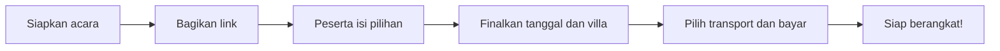

<div align="center">
  
  <h1>Jadiin</h1>
  <p><strong>Biar rencana bareng nggak berhenti di grup chat.</strong></p>
  <p>Pilih tanggal, tentukan villa, cari teman semobil, dan urus patungan.<br />Satu acara, satu link, semua ikut merencanakan.</p>
  <p><a href="https://makrab-planner.vercel.app"><strong>Buka Jadiin ↗</strong></a> &nbsp; · &nbsp; <a href="docs/SETUP.md">Panduan setup</a> &nbsp; · &nbsp; <a href="https://github.com/Asricky/Jadiin/issues">Laporkan masalah</a></p>
  <p>
    
    
    
    
  </p>
</div>

---

## Dari “kapan nih?” sampai siap berangkat

Jadiin membantu organizer merencanakan makrab dua hari satu malam bersama peserta. Setiap organizer punya ruang acara sendiri. Peserta cukup membuka link dari WhatsApp dan mengisi formulir, tanpa membuat akun.

| Untuk organizer                                     | Untuk peserta                                 |
| --------------------------------------------------- | --------------------------------------------- |
| Buat banyak acara dan atur kandidat tanggal         | Tandai waktu luang dengan drag di kalender    |
| Tambahkan villa, galeri, fasilitas, harga, dan peta | Bandingkan villa dan pilih favorit            |
| Lihat voting dan pasangan tanggal paling cocok      | Lihat perkembangan rencana bersama            |
| Tetapkan tanggal, villa, biaya, dan rekening        | Pilih sendiri kursi mobil atau motor          |
| Pantau rombongan dan rekap pembayaran               | Unggah bukti pembayaran secara private        |
| Verifikasi pembayaran dan kelola fase acara         | Buka kembali jawaban lewat link akses pribadi |

## Alurnya sederhana



**Tahap 1 — cari yang paling cocok.** Kalender ketersediaan, voting villa, informasi kendaraan, dan ringkasan hasil sementara.

**Tahap 2 — bereskan keberangkatan.** Peserta memilih kendaraan dengan kapasitas yang diperiksa database, melihat tagihan, lalu mengirim bukti pembayaran. Organizer melihat siapa ikut siapa dan siapa yang belum membayar.

## Data setiap acara tetap terjaga

- **Isolasi antar-organizer:** authorization server dan Supabase Row Level Security.
- **Akses peserta pribadi:** token acak dan cookie HttpOnly; nama bukan password.
- **Bukti pembayaran private:** signed upload, validasi isi/ukuran file di server, dan signed preview terbatas waktu.
- **Kursi tidak bisa direbut bersamaan:** assignment kendaraan memakai transaksi dan penguncian database.
- **Siap untuk Vercel:** data dan file disimpan di Supabase, tanpa persistent filesystem atau VPS.

Detail kebijakan tersedia di [authorization dan RLS](docs/SETUP.md#rls-dan-authorization) serta [Storage dan signed upload](docs/SETUP.md#storage-buckets-dan-signed-upload).

## Jalankan di komputer sendiri

Butuh **Node.js 22+**, npm, dan Docker Desktop untuk Supabase lokal.

```sh
git clone https://github.com/Asricky/Jadiin.git
cd Jadiin
npm ci
npx supabase start
node scripts/configure-local.mjs
npm run seed
npm run dev
```

Buka **http://localhost:3000**. Script konfigurasi membuat `.env.local` tanpa menampilkan secret dan tidak menimpa file yang sudah ada. Seed hanya untuk development; kredensial demo dan langkah Supabase ringan ada di [panduan setup](docs/SETUP.md).

<details>
<summary><strong>Environment variables yang diperlukan</strong></summary>

Salin [`.env.example`](.env.example) jika mengisi konfigurasi secara manual.

| Variable                        | Fungsi                                                     |
| ------------------------------- | ---------------------------------------------------------- |
| `NEXT_PUBLIC_SUPABASE_URL`      | URL proyek Supabase                                        |
| `NEXT_PUBLIC_SUPABASE_ANON_KEY` | Public/anon key untuk Auth dan upload                      |
| `SUPABASE_SERVICE_ROLE_KEY`     | Secret untuk backend saja                                  |
| `NEXT_PUBLIC_APP_URL`           | Origin publik aplikasi; gunakan domain HTTPS di production |
| `PARTICIPANT_TOKEN_SECRET`      | Secret HMAC sesi peserta, minimal 32 karakter acak         |

Service-role key tidak boleh diberi prefix `NEXT_PUBLIC_`. Jangan commit `.env.local` atau secret. Mengganti token secret akan mencabut akses peserta yang sudah ada.

</details>

## Deploy dengan database sungguhan

1. Buat proyek Supabase, login CLI, lalu link proyek dan terapkan migrasi:

   ```sh
   npx supabase login
   npx supabase link --project-ref YOUR_PROJECT_REF
   npx supabase db push
   ```

2. Hubungkan repository **Asricky/Jadiin** ke proyek Vercel dan isi environment variables untuk Production.
3. Set Auth Site URL dan callback Supabase ke domain aplikasi. Gunakan `/auth/callback` dan `/auth/callback?next=/reset-password` sebagai redirect yang diizinkan.
4. Deploy dan uji login, pembuatan acara, formulir peserta, serta upload. Menghubungkan GitHub saja **tidak** mengisi kredensial database atau menjalankan seluruh konfigurasi aplikasi.

Migrasi membuat schema, RPC, RLS, indexes, constraints, dan bucket `villa-media` (public) serta `payment-proofs` (private). [Panduan deployment lengkap →](docs/SETUP.md#deploy-ke-vercel)

## Pemeriksaan kualitas

```sh
npm run lint
npm run typecheck
npm test
npm run build
npm run test:e2e
```

Unit tests memeriksa validasi, tanggal, keamanan file, nominal pembayaran, dan domain aplikasi. Playwright menjalankan alur terhadap **Supabase sungguhan**: organizer, peserta, upload, transport, pembayaran, isolasi tenant, dan perebutan kursi terakhir. Gunakan database lokal khusus test. [Petunjuk browser dan test production →](docs/SETUP.md#tests-dan-production-build)

## Di dalam repository

```text
src/app/              Halaman, API, dan ikon aplikasi
src/components/       Antarmuka organizer dan peserta
src/lib/              Validasi, sesi, Supabase, dan perhitungan
public/brand/         Logo transparan Jadiin
supabase/migrations/  Schema, RLS, Storage policies, dan RPC
scripts/              Konfigurasi lokal dan seed demo
tests/                Unit tests dan Playwright
docs/SETUP.md         Panduan teknis dan operasional
```

**Stack:** Next.js App Router · React · TypeScript · Tailwind CSS · shadcn/ui · Lucide · Supabase · React Hook Form + Zod · date-fns · dnd-kit · Vitest · Playwright.

<div align="center">
  <sub>Dibuat dan dikelola oleh <a href="https://github.com/Asricky">Asricky</a>.<br />Dari rencana bareng, jadi cerita bareng.</sub>
</div>
